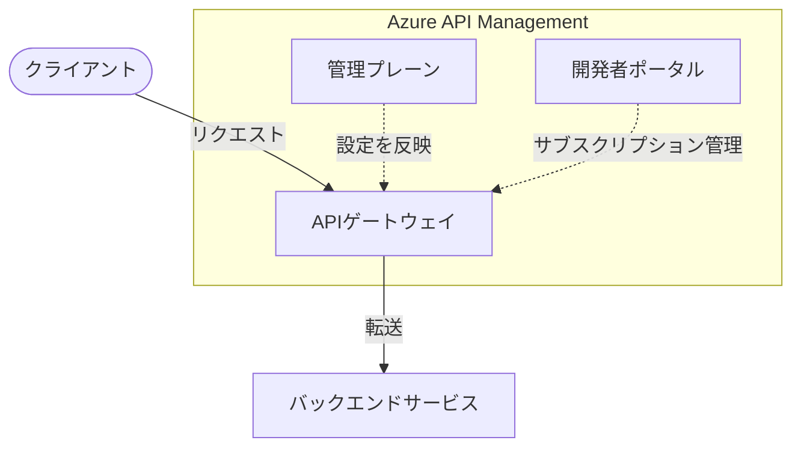

## はじめに

APIを「作る」ことと「管理する」ことは別の話です。

Azure Functionsや App Serviceを使えば、すぐにHTTP APIを動かせます。しかし複数のAPIが増えてきたとき、あるいは外部のパートナーや開発者にAPIを公開するとき、「認証をどこで統一するか」「レート制限はどう管理するか」「APIの仕様書をどう共有するか」という問題が出てきます。

Azure API Management（APIM）は、そうした「APIを管理・公開・保護する」専用のマネージドサービスです。

この記事では、APIMの概要から「使うべき場面」「使わなくていい場面」、代表的なユースケース、一緒に使われるAzureサービスまでを初学者向けに整理します。

---

## Azure APIMとは何か

Azure API Management（APIM）は、ハイブリッド・マルチクラウド環境に対応した**APIライフサイクル管理プラットフォーム**です。Microsoft公式では "a hybrid, multicloud management platform for APIs across all environments" と定義されています。

単なるプロキシではなく、API設計・公開・バージョン管理・廃止までのライフサイクル全体を支援するPaaSサービスとして位置づけられています。

### 3大コンポーネント

APIMは3つのコンポーネントで構成されています。



| コンポーネント | 別名 | 主な役割 |
|---|---|---|
| APIゲートウェイ | データプレーン / ランタイム | リクエストのプロキシ、ポリシー適用、テレメトリ収集 |
| 管理プレーン | コントロールプレーン | API定義・ポリシー・製品・ユーザー管理 |
| 開発者ポータル | Developer Portal | 外部開発者向けドキュメントサイト・サブスクリプション管理 |

**ゲートウェイ**はすべてのAPIリクエストを受け取り、バックエンドに転送しながらルーティング・セキュリティ・スロットリング・キャッシュ・観測を一元的に処理します。

**管理プレーン**はAzureポータルやREST API経由で操作し、OpenAPI/WSDL/OData/GraphQL/gRPCなど多様な形式でAPIを定義・インポートできます。

**開発者ポータル**はオープンソースのカスタマイズ可能なWebサイトで、外部の開発者がAPIドキュメントを閲覧し、試用し、APIキーを取得できる場所です。B2BやパートナーAPIを公開する場面で特に価値を発揮します。

### ゲートウェイの種類

APIMのゲートウェイは用途に応じて複数の形態があります。

| 種別 | 説明 |
|---|---|
| マネージドゲートウェイ | Azure管理のデフォルトゲートウェイ。すべてのトラフィックはAzureを経由 |
| セルフホステッドゲートウェイ | コンテナ（Docker/Kubernetes）で動かすオプション。オンプレミスや他クラウドのバックエンドに近い場所に配置できる |
| ワークスペースゲートウェイ | 開発チームごとにワークスペース単位で分離されたゲートウェイ（一部ティアのみ） |

セルフホステッドゲートウェイはAzure Kubernetes Service（AKS）やAzure Arc対応Kubernetesへのデプロイが一般的です。

### ティアの選び方

APIMにはいくつかのサービスティア（SKU）があります。新規開発では**v2ティア**を基本に選ぶのが推奨です。

| ティア | SLA | 用途 | 特記事項 |
|---|---|---|---|
| **Consumption** | なし | 開発・小規模・可変トラフィック | サーバーレス課金（実行回数単位） |
| **Basic v2** | あり | 開発・テスト | v2の最小構成。本番前の検証に |
| **Standard v2** | あり | 中規模本番 | VNet統合対応、プライベートエンドポイント |
| **Premium v2** | あり | エンタープライズ本番 | ゾーン冗長・VNetインジェクション対応 |
| Classic Premium | あり | エンタープライズ本番 | マルチリージョン・可用性ゾーン完全対応 |

:::message
**v2ティアの機能制限について**

v2ティアはより新しいインフラ基盤上に構築されており、高速なプロビジョニングとスケーリングが特徴です。一方で、クラシックティアにあった一部の機能がまだ移植されていません。

代表的な未対応例：

- **Basic v2**：現時点で開発者ポータルが利用不可
- 組み込みキャッシュ（外部Redis連携は可能）
- 一部のクラシックポリシー

「v2のほうが新しいから全部入り」とは限らないため、本番要件に合わせて[機能比較表（公式）](https://learn.microsoft.com/en-us/azure/api-management/v2-service-tiers-overview)で確認してから選定してください。
:::

**Developerティア（クラシック）について**

クラシックティアには Developer / Basic / Standard / Premium の4段階があります。このうち **Developerティアは唯一SLAがありません**。APIMの全機能（開発者ポータル・VNet統合・ポリシーエンジン等）を低コストで試せるため、ローカル検証や社内検証環境として使われます。本番ワークロードへの利用は避け、本番相当のテストをしたい場合はSLAのあるBasic v2以上を選びます。

---

## Azure APIMを使う場合・使わない場合

APIMは多機能ですが、すべての場面で必要なわけではありません。

### 使うべきケース

以下のいずれかに当てはまるなら、APIMの導入を検討します。

| 状況 | APIMが解決すること |
|---|---|
| 複数のAPIやバックエンドを一元管理したい | ルーティング・ポリシー・バージョン管理を集約 |
| 外部ユーザーやパートナーにAPIを公開したい | 開発者ポータル・サブスクリプション管理・ドキュメント自動生成 |
| 認証・レート制限・キャッシュを横断的に統一したい | ポリシーエンジンで横断的関心事を集中管理 |
| AIモデル（OpenAI等）をAPI経由で管理・制御したい | トークン消費制限・ロードバランシング・セマンティックキャッシュ |
| オンプレミスや他クラウドのAPIもAzureと一緒に管理したい | セルフホステッドゲートウェイで統合管理 |
| APIの分析・使用状況レポートが必要 | Application Insightsや組み込みアナリティクスと連携 |

### 使わなくていいケース

次のような状況では、APIMを導入しても費用・複雑さに見合わないことがあります。

| 状況 | 推奨する代替手段 |
|---|---|
| **同一サービスの複数インスタンスへの負荷分散が主な目的**（APIごとのルーティングではなく） | Azure Application Gateway / Azure Front Door |
| **単純な社内API1〜2本で認証・ポリシー不要** | Azure FunctionsのHTTPトリガーのみ |
| **AKS内のサービス間通信が主な用途** | サービスメッシュ（Istio等）|
| **パフォーマンス要件がゲートウェイ経由で達成不可能** | ゲートウェイを挟まない直接通信 |
| **プロトタイプ段階でインフラを最小限にしたい** | 必要になってから導入を検討 |

公式ドキュメントにも「ゲートウェイを導入することで合意したパフォーマンス目標の達成が不可能になる、またはトレードオフが許容できなくなる場合は、ゲートウェイを実装しないこと」と明示されています。

また、**APIMはロードバランシングを行いません**。L7ロードバランサーとしての機能はApplication Gatewayの役割です。高可用性が必要な本番環境では、Application GatewayをAPIMの前段に置く構成が一般的です。

---

## 代表的な利用シナリオ

### シナリオ①：マイクロサービスAPIの統合ゲートウェイ

複数のマイクロサービスが存在するシステムでは、クライアントがどのエンドポイントを呼べばいいかわからなくなりがちです。新しいサービスの追加やリファクタリングのたびにクライアント側も変更が必要になり、認証やSSL終端の処理も各サービスで重複します。

APIMを「単一の入口」として配置することで、これらの問題を解消できます。

```
クライアント
    ↓
[Azure Application Gateway] ← ロードバランシング・WAF
    ↓
[Azure APIM] ← 認証・レート制限・ルーティング・ポリシー
    ↙        ↓        ↘
Functions    AKS    App Service
（注文）  （在庫）  （ユーザー）
```

クライアントはAPIMの一つのエンドポイントだけを知っていればよく、バックエンドの変更を隠蔽できます。

### シナリオ②：B2Bパートナー向けAPI公開

外部企業とAPIで連携する場合、相手側の開発者がAPIを「発見・試用・利用開始」できるセルフサービスの仕組みが重要です。

APIMの開発者ポータルを使うと：

- パートナー企業の開発者が自分でAPIキーを取得できる
- インタラクティブなコンソールでAPIを試用できる
- 企業・チーム単位でレート制限や使用量分析を分けられる
- Microsoft Entra ID（旧Azure AD）と連携した認証を統一できる

これにより「メールでAPIキーを発行する」「手動でドキュメントを送る」といった作業がなくなります。

### シナリオ③：AIゲートウェイ（Azure OpenAI / LLM連携）

AIモデルへのAPIアクセスが増える中で、APIMを「AIゲートウェイ」として使うパターンが急速に普及しています。

APIMにはAIゲートウェイ専用の機能が組み込まれています：

| 機能 | 概要 |
|---|---|
| トークン消費制限 | APIキー単位・製品単位でトークン上限を設定 |
| トークン使用量メトリクス | 消費量を計測してApplication Insightsに送信 |
| セマンティックキャッシュ | 意味的に近い質問への回答をキャッシュしてコスト削減 |
| ロードバランシング/フェイルオーバー | 複数のOpenAIエンドポイント間で分散・切り替え |
| LLM API統合 | OpenAI互換（Hugging Face TGI、Gemini等）・非互換モデルもパススルーで管理可能 |

Azure AI Foundry（旧Azure OpenAI Studio）にはAPIMとのネイティブ統合があり、FoundryポータルからそのままAPIゲートウェイを有効化できます。

---

## 一緒に使われるAzureサービス

APIMは他のAzureサービスと組み合わせることで力を発揮します。構成レイヤー別に整理します。

### バックエンド（APIの実体）

| サービス | 役割 | APIMとの関係 |
|---|---|---|
| **Azure Functions** | 軽量HTTPバックエンド | APIMのバックエンドとして最も一般的な選択肢 |
| **Azure Logic Apps** | ワークフロー・EAI | B2Bや外部サービス連携のバックエンド |
| **Azure Kubernetes Service（AKS）** | コンテナマイクロサービス | APIMの後段でサービスを分割・管理 |
| **Azure App Service** | Webアプリ・REST API | 既存アプリをAPIM経由で公開 |

### 認証・セキュリティ

| サービス | 役割 |
|---|---|
| **Microsoft Entra ID**（旧Azure AD） | OAuthトークン検証・ユーザー認証の統合。`validate-jwt`ポリシーと組み合わせて使う |
| **Azure Key Vault** | APIキー・証明書・シークレットの安全な保管。APIMからマネージドIDで参照 |
| **Web Application Firewall（WAF）** | Application GatewayやFront DoorのWAF機能でSQLインジェクション等を防御 |

### 観測・監視

| サービス | 役割 |
|---|---|
| **Application Insights** | リクエストトレース・レイテンシ・エラー追跡。APIMと1クリックで統合可能 |
| **Azure Monitor** | メトリクス監視・アラート・ダッシュボード |
| **Azure Event Grid** | API作成・削除などのライフサイクルイベントをトリガーにした自動化 |

### ネットワーク・トラフィック制御

| サービス | 役割 |
|---|---|
| **Azure Application Gateway** | L7ロードバランサー・WAF。APIMの前段に置いてロードバランシングを担当 |
| **Azure Front Door** | グローバルCDN・エッジロードバランシング。APIMをグローバル展開する際に使用 |
| **Azure Virtual Network** | APIMをプライベートネットワーク内に配置（Standard v2以上で対応） |
| **Azure Managed Redis** | APIMのレスポンスキャッシュのバックストア |

---

## まとめ

Azure APIMを選ぶかどうかの判断をシンプルに整理すると次のようになります。

```
APIが複数ある、または外部公開する
    → YES → APIM を検討する
    → NO  → Azure Functions の HTTPトリガーだけでも十分かもしれない

ロードバランシングが主目的
    → YES → Application Gateway / Front Door を先に検討
    → NO  → APIM が候補に入る

AIモデルAPI（OpenAI等）を管理・制御したい
    → YES → APIM のAIゲートウェイ機能が有効
```

APIMの主な価値は「複数APIの一元管理」「外部公開のセルフサービス化」「ポリシーエンジンによる横断的な制御」の3点です。逆に、これらが不要な小規模・単純な構成では過剰投資になります。

**次に学ぶとよいこと：**
- APIMのポリシーエンジン（inbound / backend / outbound / on-error）
- Azure FunctionsとAPIMの具体的な統合手順
- Terraform/BicepによるAPIMのIaC管理
- OpenAI連携の具体的な設定（トークン制限・セマンティックキャッシュ）

---

## 参考リンク

- [Azure API Management - Overview and Key Concepts](https://learn.microsoft.com/en-us/azure/api-management/api-management-key-concepts)
- [API Gateway Overview in Azure API Management](https://learn.microsoft.com/en-us/azure/api-management/api-management-gateways-overview)
- [V2 Service Tiers Overview](https://learn.microsoft.com/en-us/azure/api-management/v2-service-tiers-overview)
- [API gateways for microservices - Azure Architecture Center](https://learn.microsoft.com/en-us/azure/architecture/microservices/design/gateway)
- [Access Language Models through a Gateway - Azure Architecture Center](https://learn.microsoft.com/en-us/azure/architecture/ai-ml/guide/azure-openai-gateway-guide)
- [Architecture Best Practices for Azure API Management](https://learn.microsoft.com/en-us/azure/well-architected/service-guides/azure-api-management)
